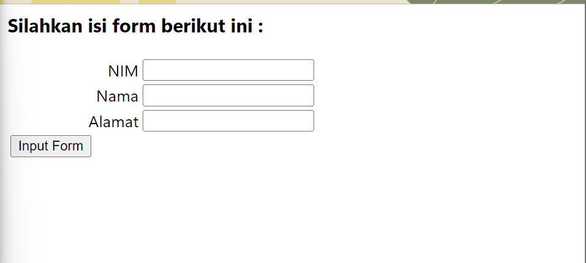

# **Lab 10 PHP OOP**
```
Nama    : Dipca Anugrah
NIM     : 312210666
Kelas   : TI.22.A.4
Matkul  : Pemrograman Web 1
```
## **Daftar Isi**
**[Instruksi Praktikum](#instruksi-praktikum)**

**[Langkah-langkah Praktikum](#langkah-lankgah-praktikum)**

**[Pertanyaan dan Tugas](#pertanyaan-dan-tugas)**

**[Result](#result)**

## **Instruksi Praktikum**

1. Persiapkan text editor misalnya VSCode.
2. Buat folder baru dengan nama lab10_php_oop pada docroot webserver (htdocs)
3. Ikuti langkah-langkah praktikum yang akan dijelaskan berikutnya.

## **Langkah-lankgah Praktikum**

1. Buat file baru dengan nama **mobil.php**

[mobil.php](contoh_latihan/mobil.php)


2. **Class library**
Class library merupakan pustaka kode program yang dapat digunakan bersama pada beberapa 
file yang berbeda (konsep modularisasi). Class library menyimpan fungsi-fungsi atau class 
object komponen untuk memudahkan dalam proses development aplikasi.
- **Contoh class library untuk membuat form.**
    ```php
        <?php
        /**
        * Nama Class: Form
        * Deskripsi: CLass untuk membuat form inputan text sederhan
        **/
        class Form
        {
        private $fields = array();
        private $action;
        private $submit = "Submit Form";
        private $jumField = 0;
        public function __construct($action, $submit)
        {
        $this->action = $action;
        $this->submit = $submit;
        }
        public function displayForm()
        {
        echo "<form action='".$this->action."' method='POST'>";
        echo '<table width="100%" border="0">';
        for ($j=0; $j<count($this->fields); $j++) {
        echo "<tr><td 
        align='right'>".$this->fields[$j]['label']."</td>";
        echo "<td><input type='text' 
        name='".$this->fields[$j]['name']."'></td></tr>";
        }
        echo "<tr><td colspan='2'>";
        echo "<input type='submit' value='".$this->submit."'></td></tr>";
        echo "</table>";
        }
        public function addField($name, $label)
        {
        $this->fields [$this->jumField]['name'] = $name;
        $this->fields [$this->jumField]['label'] = $label;
        $this->jumField ++;
        }
        }
        ?>
    ```
    File tersebut tidak dapat dieksekusi langsung, karena hanya berisi deklarasi class. Untuk menggunakannya perlu dilakukan include pada file lain yang akan menjalankan dan harus dibuat instance object terlebih dulu.

- **Contoh implementasi pemanggilan class library form.php**

    Buat file dengan nama **form_input.php**
    ```php
        <?php
        /**
        * Program memanfaatkan Program 10.2 untuk membuat form inputan sederhana.
        **/
        include "form.php";
        echo "<html><head><title>Mahasiswa</title></head><body>";
        $form = new Form("","Input Form");
        $form->addField("txtnim", "Nim");
        $form->addField("txtnama", "Nama");
        $form->addField("txtalamat", "Alamat");
        echo "<h3>Silahkan isi form berikut ini :</h3>";
        $form->displayForm();
        echo "</body></html>";
        ?>
    ```

    

    Buat file dengan nama **database.php**

    [database.php](contoh_latihan/database.php)


## **Pertanyaan dan Tugas**
Implementasikan konsep modularisasi pada kode program pada praktikum sebelumnya dengan menggunakan class library untuk **form** dan **database connection**.

- **Membuat file config.php**

    ```php
    <?php

    return [
        'host' => 'localhost',
        'username' => 'root',
        'password' => '',
        'latihan1' => 'latihan1',
    ];

    ?>
    ```
    File `config.php` ini berfungsi untuk menyimpan konfigurasi yang diperlukan oleh aplikasi, terutama informasi koneksi ke database. Dengan menggunakan file konfigurasi seperti ini, Anda dapat dengan mudah mengelola dan mengubah informasi koneksi atau konfigurasi lainnya tanpa harus menyunting langsung file kode program yang menggunakannya.

    Pada kasus ini, file `config.php` menyimpan informasi berikut:

    - `'host' => 'localhost'`: Menyimpan host database (biasanya 'localhost' jika database berada di server yang sama dengan aplikasi).
    - `'username' => 'root'`: Menyimpan nama pengguna untuk koneksi database.
    - `'password' => ''`: Menyimpan kata sandi untuk koneksi database.
    - `'latihan1' => 'latihan1'`: Menyimpan nama database yang akan digunakan.

    Dengan menyimpan informasi ini di file terpisah, Anda dapat dengan mudah memperbarui atau mengganti konfigurasi database tanpa harus menyunting langsung file-file yang menggunakannya. Ini mempermudah pemeliharaan dan konfigurasi aplikasi secara keseluruhan.
- **Menghapus file koneksi.php**

    File koneksi.php tidak dibutuhkan karena fungsionalitas koneksi telah dimasukkan langsung ke dalam class Database di file database.php. Oleh karena itu, semua logika koneksi dan method yang terkait dengannya disatukan dalam satu class.

    Di dalam class Database, metode __construct memanggil metode connect, yang menginisialisasi koneksi database menggunakan informasi yang diperoleh dari file config.php. Dengan struktur ini, Anda dapat membuat objek $db menggunakan new Database(), dan koneksi database akan dibuat secara otomatis.

    Jadi, pada dasarnya, file koneksi.php tidak diperlukan lagi karena logika koneksi telah disatukan dalam class Database. Namun, pastikan bahwa file config.php masih berisi informasi koneksi database yang sesuai.

- **Membuat file database.php**
    ```php
    <?php

    class Database
    {
        protected $conn;

        public function __construct($host, $user, $password, $db_name)
        {
            $this->conn = new mysqli($host, $user, $password, $db_name);

            if ($this->conn->connect_error) {
                die("Connection failed: " . $this->conn->connect_error);
            }
        }

        public function query($sql)
        {
            return $this->conn->query($sql);
        }

        public function escapeString($value)
        {
            return $this->conn->real_escape_string($value);
        }

        public function closeConnection()
        {
            $this->conn->close();
        }
    }

    ?>

    ```

    Program tersebut adalah implementasi kelas `Database` dalam PHP yang bertujuan untuk menyediakan fungsionalitas dasar untuk berinteraksi dengan database MySQL. Berikut adalah penjelasan singkat tentang setiap metode dalam kelas tersebut:

    1. **`__construct`**: Ini adalah konstruktor kelas yang akan dijalankan secara otomatis saat objek dibuat. Fungsinya adalah untuk membuka koneksi ke database MySQL menggunakan informasi koneksi yang diberikan (host, username, password, nama database). Jika koneksi gagal, program akan menghentikan eksekusi dan menampilkan pesan kesalahan.

    2. **`query`**: Metode ini digunakan untuk mengeksekusi kueri SQL ke database. Fungsi ini menerima kueri SQL sebagai parameter dan mengembalikan hasil dari eksekusi kueri tersebut.

    3. **`escapeString`**: Metode ini digunakan untuk menghindari serangan SQL injection. Fungsi ini menerima nilai sebagai parameter dan mengembalikan nilai yang telah diubah agar aman untuk digunakan dalam sebuah kueri SQL.

    4. **`closeConnection`**: Metode ini digunakan untuk menutup koneksi ke database. Memastikan bahwa sumber daya database yang digunakan oleh skrip PHP dilepaskan setelah selesai digunakan.

    Dengan adanya kelas ini, Anda dapat membuat objek `Database` dan menggunakannya untuk menjalankan kueri SQL, menghindari serangan SQL injection, dan menutup koneksi setelah digunakan, yang semuanya merupakan praktik pengembangan web yang baik.

- **Membuat file formlibary**
    ```php
    <?php

    class FormLibrary
    {
        public static function generateTable($result)
        {
            $tableHTML = '<table class="data-table">
                            <tr>
                                <th>Gambar</th>
                                <th>Nama Barang</th>
                                <th>Kategori</th>
                                <th>Harga Jual</th>
                                <th>Harga Beli</th>
                                <th>Stok</th>
                                <th>Aksi</th>
                            </tr>';

            if ($result->num_rows > 0) {
                while ($row = $result->fetch_assoc()) {
                    $tableHTML .= '<tr>
                                    <td></td>
                                    <td>' . $row['nama'] . '</td>
                                    <td>' . $row['kategori'] . '</td>
                                    <td>' . $row['harga_beli'] . '</td>
                                    <td>' . $row['harga_jual'] . '</td>
                                    <td>' . $row['stok'] . '</td>
                                    <td class="aksi">
                                        <a class="ubah" href="ubah.php?id=' . $row['id_barang'] . '">Ubah</a>
                                        <a class="hapus" href="hapus.php?id=' . $row['id_barang'] . '">Hapus</a>
                                    </td>
                                </tr>';
                }
            } else {
                $tableHTML .= '<tr>
                                <td colspan="7">Belum ada data</td>
                            </tr>';
            }
            

            $tableHTML .= '</table>';
            return $tableHTML;
        }

        public static function generateUbah($currentValue, $options)
        {
            $html = '';
            foreach ($options as $value => $label) {
                $selected = ($value == $currentValue) ? 'selected="selected"' : '';
                $html .= "<option value=\"$value\" $selected>$label</option>";
            }
            return $html;
        }
    }
    ?>

    ```

- **Konfigurasi file yang sebelumnya sudah dibuat**

    - **index.php**
        ```php
        <?php
        include("database.php");
        include("formlibary.php");

        $config = include("config.php");

        $db = new Database($config['host'], $config['username'], $config['password'], $config['latihan1']);
        $sql = 'SELECT * FROM data_barang';
        $result = $db->query($sql);

        ?>

        <!DOCTYPE html>
        <html lang="en">

        <head>
            <meta charset="UTF-8">
            <meta name="viewport" content="width=device-width, initial-scale=1.0">
            <title>Data Barang</title>
            <link rel="stylesheet" href="css/styles.css">
        </head>

        <body>
            <div class="container">
                <?php require('header.php'); ?>
                <h2>Data Barang</h2>
                <div class="main">
                    <a class="tambah" href="tambah.php">Tambah Barang</a>
                    <?php echo FormLibrary::generateTable($result); ?>
                </div>
                <?php require('footer.php'); ?>
            </div>
        </body>

        </html>

        <?php
        // Jangan lupa untuk menutup koneksi setelah selesai menggunakannya
        $db->closeConnection();
        ?>

        ```

    - **tambah.php**
        ```php
        <?php
        error_reporting(E_ALL);
        include_once 'database.php';
        include_once 'formlibary.php';

        $db = new Database("localhost", "root", "", "latihan1");

        if (isset($_POST['submit'])) {
            $nama = $db->escapeString($_POST['nama']);
            $kategori = $db->escapeString($_POST['kategori']);
            $harga_jual = $db->escapeString($_POST['harga_jual']);
            $harga_beli = $db->escapeString($_POST['harga_beli']);
            $stok = $db->escapeString($_POST['stok']);
            $file_gambar = $_FILES['file_gambar'];
            
            // Menghapus 'gambar/' dari nama file
            $gambarTampilan = str_replace('gambar/', '', $file_gambar['name']);
            $gambar = null;

            if ($file_gambar['error'] == 0) {
                $filename = str_replace(' ', '_', $file_gambar['name']);
                $destination = dirname(__FILE__) . '/gambar/' . $filename;

                if (move_uploaded_file($file_gambar['tmp_name'], $destination)) {
                    $gambar = 'gambar/' . $filename;
                }
            }

            $sql = "INSERT INTO data_barang (nama, kategori, harga_jual, harga_beli, stok, gambar) ";
            $sql .= "VALUES ('{$nama}', '{$kategori}', '{$harga_jual}', '{$harga_beli}', '{$stok}', '{$gambar}')";

            $result = $db->query($sql);

            if (!$result) {
                echo "Error: " . $db->getError();
            } else {
                header('location: index.php');
            }
        }

        ?>

        <!DOCTYPE html>
        <html lang="en">
        <head>
            <meta charset="UTF-8">
            <link href="css/styles3.css" rel="stylesheet" type="text/css" />
            <title>Tambah Barang</title>
        </head>
        <body>
            <div class="container">
                <h1>Tambah Barang</h1>
                <div class="main">
                    <form method="post" action="tambah.php" enctype="multipart/form-data">
                        <div class="input">
                            <label>Nama Barang</label>
                            <input type="text" name="nama" required />
                        </div>
                        <div class="input">
                            <label>Kategori</label>
                            <select name="kategori" required>
                                <option value="Komputer">Komputer</option>
                                <option value="Elektronik">Elektronik</option>
                                <option value="Hand Phone">Hand Phone</option>
                            </select>
                        </div>
                        <div class="input">
                            <label>Harga Jual</label>
                            <input type="text" name="harga_jual" required />
                        </div>
                        <div class="input">
                            <label>Harga Beli</label>
                            <input type="text" name="harga_beli" required />
                        </div>
                        <div class="input">
                            <label>Stok</label>
                            <input type="text" name="stok" required />
                        </div>
                        <div class="input">
                            <label>File Gambar</label>
                            <input type="file" name="file_gambar" required />
                        </div>
                        <div class="submit">
                            <input type="submit" name="submit" value="Simpan" />
                        </div>
                    </form>
                </div>
            </div>
        </body>
        </html>
            
        ```
    - **ubah.php**
        ```php
        <?php
        error_reporting(E_ALL);
        include_once 'database.php';
        include_once 'formlibary.php';

        $db = new Database("localhost", "root", "", "latihan1");

        if (isset($_POST['submit'])) {
            $id = $db->escapeString($_POST['id']);
            $nama = $db->escapeString($_POST['nama']);
            $kategori = $db->escapeString($_POST['kategori']);
            // ... (other form data)

            // Build your SQL statement based on the form data
            $sql = "UPDATE data_barang SET nama='{$nama}', kategori='{$kategori}' WHERE id_barang='{$id}'";

            $result = $db->query($sql);

            if (!$result) {
                die('Error: ' . $db->getError());
            } else {
                header('location: index.php');
            }
        }

        $id = $_GET['id'];
        $sql = "SELECT * FROM data_barang WHERE id_barang = '{$id}'";
        $result = $db->query($sql);
        if (!$result) {
            die('Error: Data tidak tersedia');
        }
        $data = mysqli_fetch_array($result);

        $db->closeConnection();
        ?>
        <!DOCTYPE html>
        <html lang="en">
        <head>
            <meta charset="UTF-8">
            <link href="css/styles2.css" rel="stylesheet" type="text/css" />
            <title>Ubah Barang</title>

        </head>
        <body>
            <div class="container">
                <h1>Ubah Barang</h1>
                <div class="main">
                    <form method="post" action="ubah.php" enctype="multipart/form-data">
                        <div class="input">
                            <label>Nama Barang</label>
                            <input type="text" name="nama" value="<?php echo $data['nama'];?>" />
                        </div>
                        <div class="input">
                            <label>Kategori</label>
                            <select name="kategori">
                                <?php
                                    $options = [
                                        'Komputer' => 'Komputer',
                                        'Elektronik' => 'Elektronik',
                                        'Hand Phone' => 'Hand Phone'
                                    ];
                                    echo FormLibrary::generateUbah($data['kategori'], $options);
                                ?>
                            </select>
                        </div>
                        <!-- Sisanya tetap di sini -->
                        <div class="submit">
                            <input type="hidden" name="id" value="<?php echo $data['id_barang'];?>" />
                            <input type="submit" name="submit" value="Simpan" />
                        </div>
                    </form>
                </div>
            </div>
        </body>
        </html>
  
        ```

    - **hapus.php**
        ```php
        <?php
        include_once 'database.php'; // Include your database connection file

        // Check if 'id' is set in the URL parameters
        if (isset($_GET['id'])) {
            $id = $_GET['id'];

            // Create a new Database object
            $db = new Database("localhost", "root", "", "latihan1");

            // Use the database connection from the Database object
            $result = $db->query("DELETE FROM data_barang WHERE id_barang = '{$id}'");

            if (!$result) {
                // Handle errors if the query execution fails
                die('Error: ' . $db->getError());
            }

            // Close the database connection
            $db->closeConnection();

            // Redirect to index.php after successful deletion
            header('location: index.php');
        } else {
            echo 'Invalid request. Please provide an ID.';
        }
        ?>
 
        ```


## **Result**


<hr>

**[Back-->](#lab-10-php-oop)**